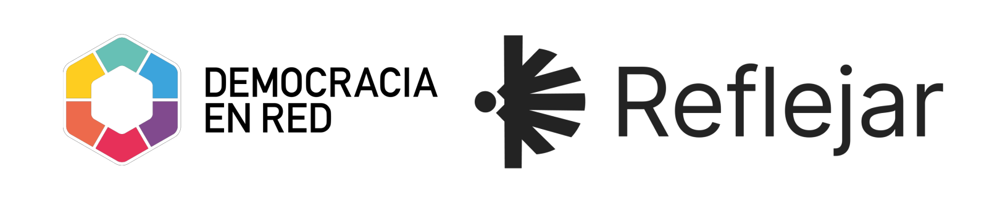

# PIS - Aplicaciones Shiny

Aplicaciones realizadas en R shiny para proyecto PIS de Democracia en Red

- Módulo de Testeos

## Setup

ToDo

## Licencia

El siguiente repositorio es un desarrollo de codigo abierto bajo la licencia GNU General Public License v3.0. Pueden acceder a la haciendo [click aqui](./LICENSE).

